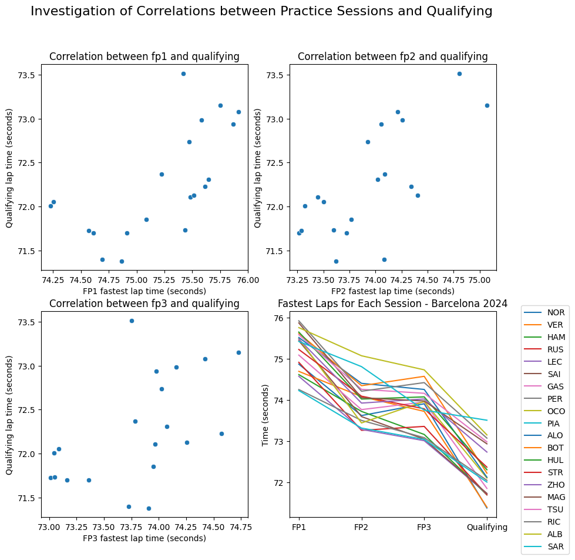
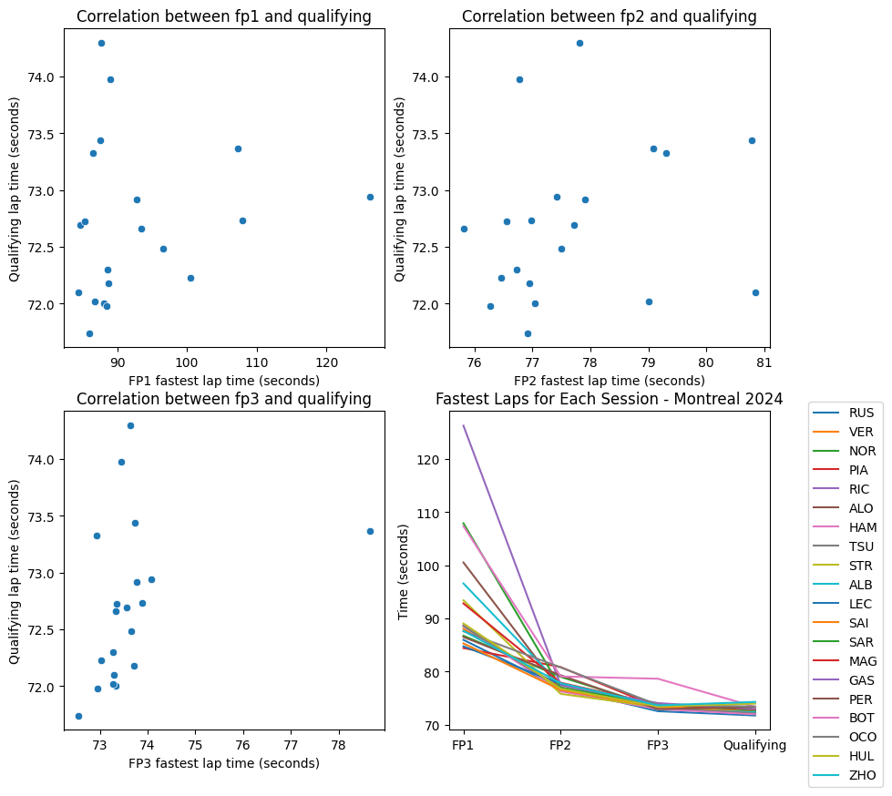

# F1 PredictQualifying
Designed for the MLOps Zoomcamp. This repository contains code that we will use to predict the qualifying results based on the practice times. If you are checking out the repo for the purposes of grading for the course please also see the [`grading_cheatsheet.md`](grading_cheatsheet.md). Please note this is still very much under construction at the moment so any feedback is greatly appreciated rather than just pointing out where things are missing.

## What is F1 Qualifying?
F1 is a global motor racing competition, ~20 drivers particpate at each race which takes place typically on a Sunday. However throughout the weekend there are other sessions that take place.

### Race Weekend Structure
* Free Practice 1: This typically occurs on a Friday and lasts for 90 minutes.
* Free Practice 2: Also takes place on a Friday and lasts for 90 minutes.
* Free Practice 3: This takes place on a Saturday morning and lasts for 60 minutes.
* Qualifying: This takes place on Saturday afternoon and sets the starting order for the race on Sunday. Within qualifying there are 3 sub-sessions
    * Q1: This session lasts 15 minutes, and the slowest 5 cars at the end are eliminated (currently 20->15).
    * Q2: This session lasts 15 minutes, and the slowest 5 cars at the end are eliminated (currently 15->10).
    * Q3: Here the 10 remaining cars have 10 minutes to produce the fastest lap possible. This sets the order for the Grid
* Race: This is the main focus and where points are awarded.

NB There are other structures which include sprint races. Currently this format is still in flux and so will not be used for any predictions.

### The Aim
The aim is to take key performance metrics from the three practice sessions and see whether we can predict the qualifying times, and therefore the grid order.

### The Problem
This is more than simply taking the fastest lap that a driver does during the practice session and predicting that. The speed of F1 cars can vary depending on a number of other conditions, for example using more durable but less "grippy" tyres, track conditions such as rain, and also heavier fuel loads can slow a car down. 

For example if you look at the race from Barcelona this year, we see a nice general trend downwards where the lap times decrease the closer you get to qualifying



However one race earlier in Montreal the qualifying times become harder to predict due to weather conditions (it rained during Free Practice 1 and a little bit during qualifying)


Producing a model that can take all these factors into account cannot be easily calculated, and needs to be updated after practice sessions

### The benefits
This is will hopefully be useful in order to assess which cars are actually the fastest. Additionally, if we blind the model to the driver, we can see whether the driver is performing as well as the model predicts. If a driver is consistently outperforming the model one can assume that the driver is faster than the average driver

## How to set it up
### Data ETL
F1 produces large numbers of metrics which can be accessed using the [FastF1 python library](https://docs.fastf1.dev/). I've written an [ETL module](https://github.com/mleiwe/F1_PredictQualifying/tree/main/FastF1_DataAccess) to pull from it. 

This can be sampled in this [notebook](ETL_data_example.ipynb). NB FastF1 is slow, so it takes ~6 minutes on my computer to process each event. Feel free to give it a go but I don't recommend processing all the data.
All the data used is saved in this repo in the `./Data` folder as csv files for each F1 event. The Mage.ai orchestration pipeline will take you on from there.

*If you're marking my project for the MLOps course, go easy on me here. This took much longer than I was expecting given how the data was organised and how I needed to transform it to get what I want*

### Running Mage
The orchestration is run separately to the data ETL mostly because I don't want to be running the ETL often. 
To view the pipelines open up a terminal window and change directort to this repository, then the mage-quickstart folder.
For example

```bash
cd F1_PredictQualifying/mage-quickstart
```
Then run the docker compose
```bash
docker compose up -d
```
The Mage project will be accesible on `http://localhost:6789/` in your browser.

Once you are finished simply close your tab and then shut down the image(s) with.
```bash
docker compose down
```
Below is a brief description of each pipeline

#### prepare_data_from_csvs
This will access the data from the main brain of the GitHub repo that has been committed rather than the files stored locally to ensure consistency
It performs the following steps
1. Concatenating all the event data into a single dataframe
2. Dropping any identifiable data regarding the driver (i.e. their name and driver number). The team I consider fair use for the model
3. Check how much data is missing and where faults are in the ETL process etc. --> These are also monitorable on the dashboard
4. Simplify the dataframe, this selects which columns will be used to be used in the Global Data Product.

#### train_model
**Under construction**
Currently a placeholder random forest is there.

#### model_predict_full
TBB - To be built

#### model_predict_hypothetical
TBB - To be built

